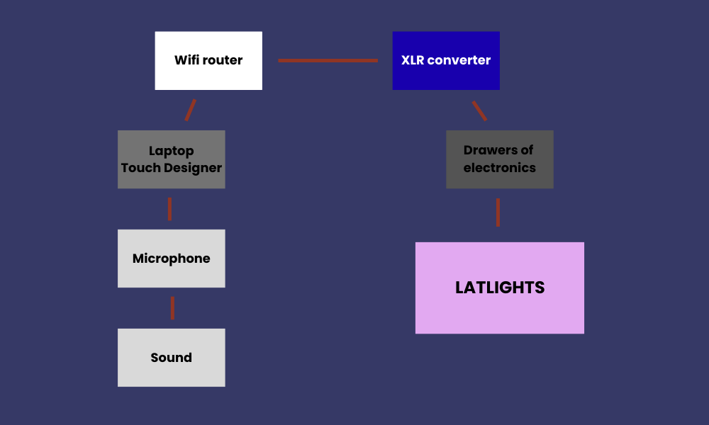
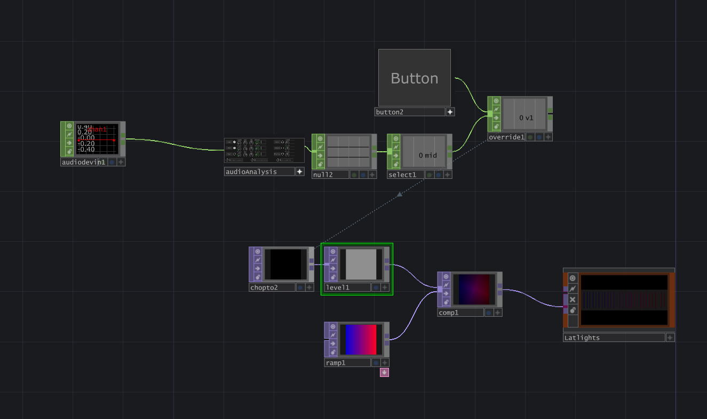
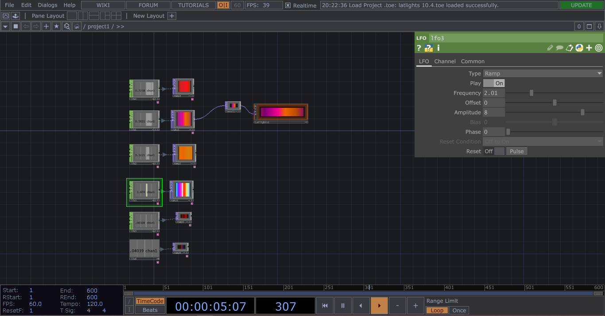

# Werkstatt Light Show

## Project idea
This project is a live-controlled light installation made for the reopening of Werkstatt, a cozy cultural bar and nightlife venue in the old town of Chur. The idea was to create an engaging light show that supports the DJ and band performances and makes the stage stand out. Instead of using fully automatic, music-reactive lights, the visuals were controlled by hand in TouchDesigner, allowing for a better match with the beat and mood of the music. This made the light show feel more natural and cleaner. The system changes colors, rhythm, and brightness in real time, adjusted to each performer. By discussing the visual style with both the DJ and the band, the experience became enjoyable not only for the audience, but also for the artists on stage.

## Technical documentation

### Reproducibility: 
01. Connect Latlights
02. Make sure the internet is connected
03. Open Touchdesigner
04. Make Chop: Audio device in
05. Connect Chop: Audio Analysis
06. Test surrounding audio and see which stands out the most
07. Connect a Chop: Null for easy oversight
08. Connect a Chop: Select and select the one that stands out
09. Add a Chop: Override and button as back up
10. Add a Chop to... and connect it to a level
11. Be creative with the settings in the level
12. Make a ramp with a cool colour scheme
13. Connect the level and ramp to a top: Comp
14. Add that to the Latlights

### Hardware:
- Microphone: Picking up the sound
- Latlights: The actual visuals
- Wifi Router: Connect everything on the location
- XLR converter: Connect the wifi to the latlights
- 4 Drawers with electronics: This will run the latlights.

### Software:
Touchdesigner: The make the system work

### Touch Designer:

The audio device picks the sound up from the microphones and then the audio analysis picks the right frequencies. We select those frequencies and put it to a TOP. Then the audio waves change the intensity of the brightness and gamma. We put this in the comp and then add a colour ramp. So the levels change things in the comp and the colours. Then we move this to the latlights.

### Backup Plan that we used:

This includes the different color combinations and speed that the artists and bands wanted. Ready to be changed anytime at will.

## Videos

